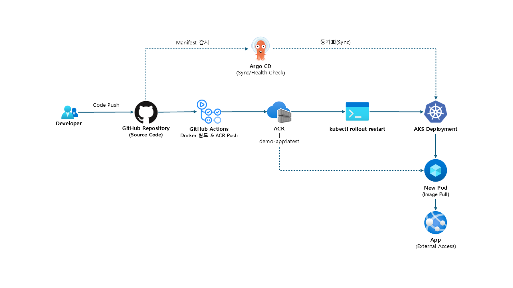
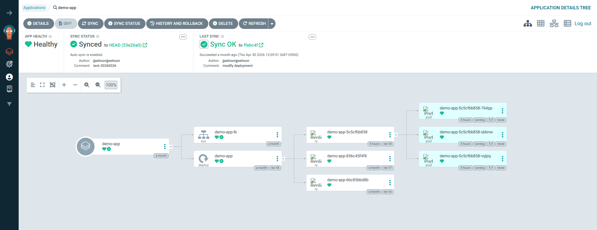

# Architecture

## CI/CD Flow

## Argo CD Resource Tree

위 이미지는 Argo CD에서 확인한 `demo-app` Application의 k8s 리소스 관계를 보여줍니다.  
`demo-app` Application은 `demo-app-lb` Service와 `demo-app` Deployment를 포함하며, Deployment는 ReplicaSet과 Pod를 통해 실제 컨테이너 애플리케이션을 실행합니다.

